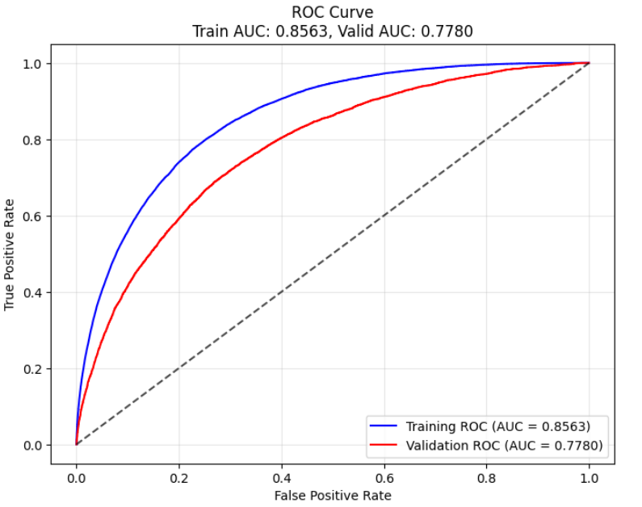
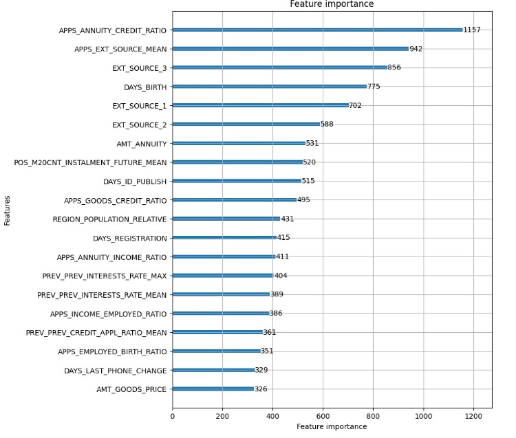

# Home Credit Default Risk Prediction

## Overview
This project aims to predict the likelihood of a client defaulting on a loan using the **Home Credit Default Risk** dataset from Kaggle. The dataset contains financial and demographic data of applicants, including past credit history, income, and loan details.

## Dataset
- **Source**: [Home Credit Default Risk Dataset](https://www.kaggle.com/competitions/home-credit-default-risk/data)
- **Description**: The dataset consists of multiple files, including application records, bureau data, previous loans, and credit card history, which help assess the credit worthiness of applicants.

## Approach
1. **Data Preprocessing**:
   - Handling missing values
   - Encoding categorical features
   - Feature engineering (creating meaningful derived features and aggregation)
   - Data scaling and normalization
2. **Exploratory Data Analysis (EDA)**:
   - Understanding data distributions
   - Identifying key predictors using correlation analysis
   - Visualizing class imbalance
3. **Model Training & Evaluation**:
   - Using models like Logistic Regression, Decision Trees, Random Forest, and LightGBM
   - Handling class imbalance using different techniques
   - Feature selection based on importance scores
   - Hyperparameter tuning
   - Model selection (**LightGBM**)
   - Explainability using SHAP values

## Model Results
Below are the evaluation results of the best-performing model:

### ROC AUC Curve


### Important Features


## Generative AI Tools Usage
Generative AI tools were utilized in the following areas:
- Feature engineering and data augmentation strategies
- Hyperparameter tuning recommendations
- Documentation and report generation (Function docstrings, comments)

## How to Run
1. Clone the repository:
   ```python
   git clone https://github.com/paldp20/Home_credit_default_risk_prediction.git
   cd Home_credit_default_risk_prediction
   ```
2. Install dependencies:
   ```python
   pip install -r requirements.txt
   ```
3. Run the main UI script:
   ```python
   streamlit run app.py
   ```

